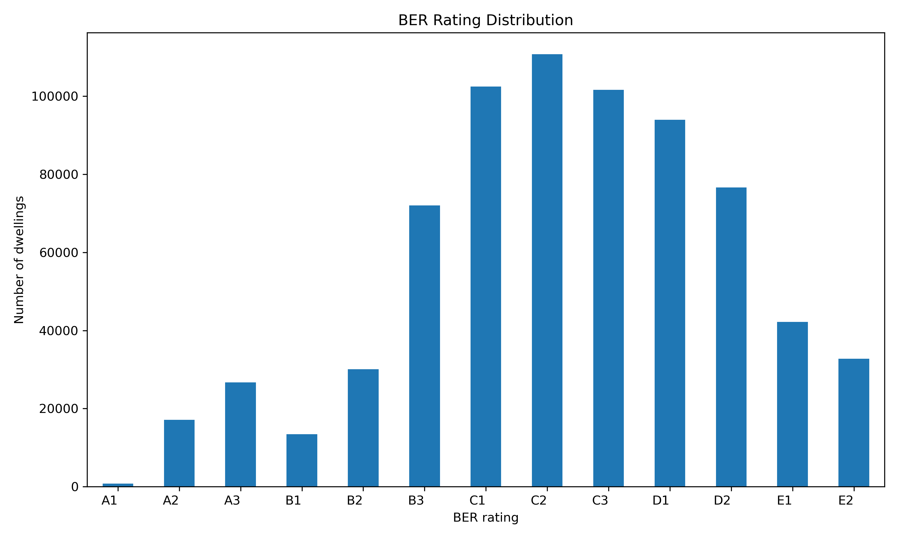
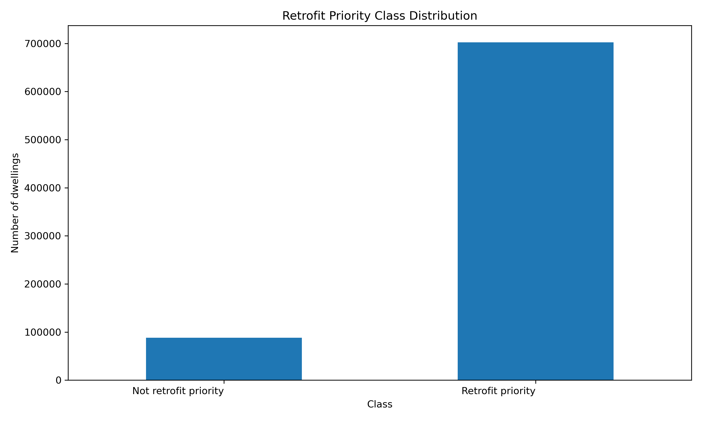
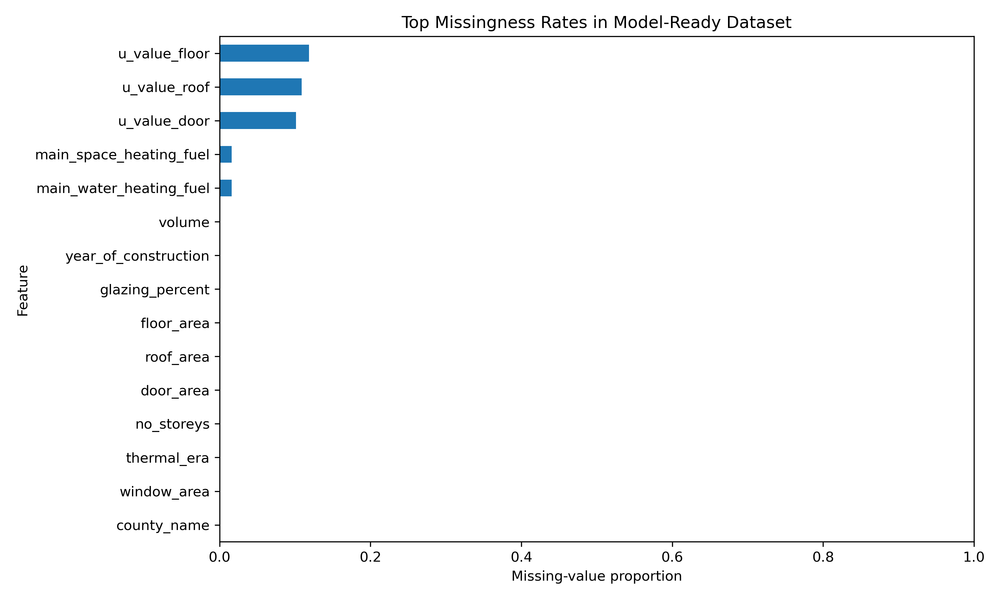
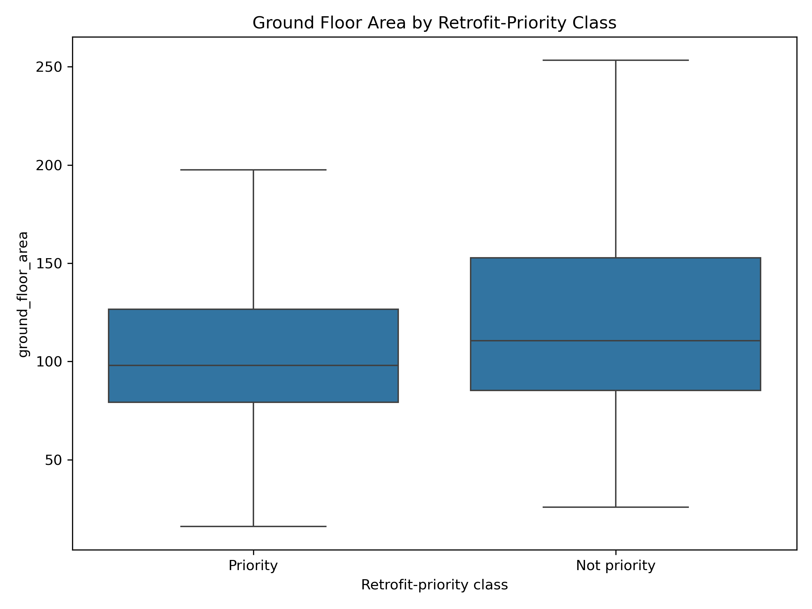
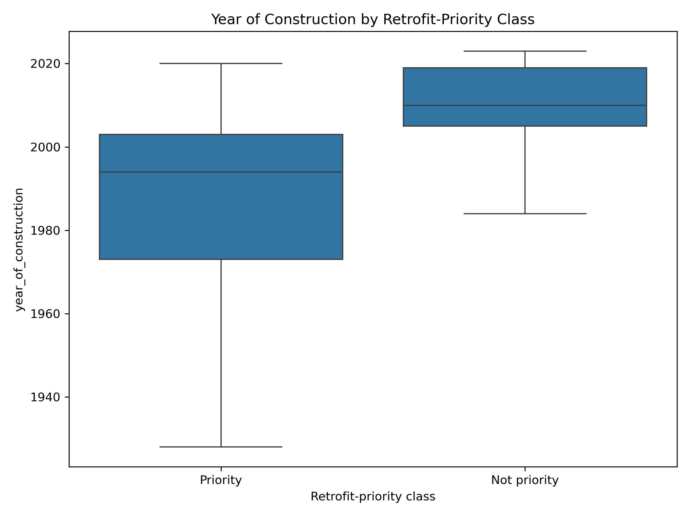
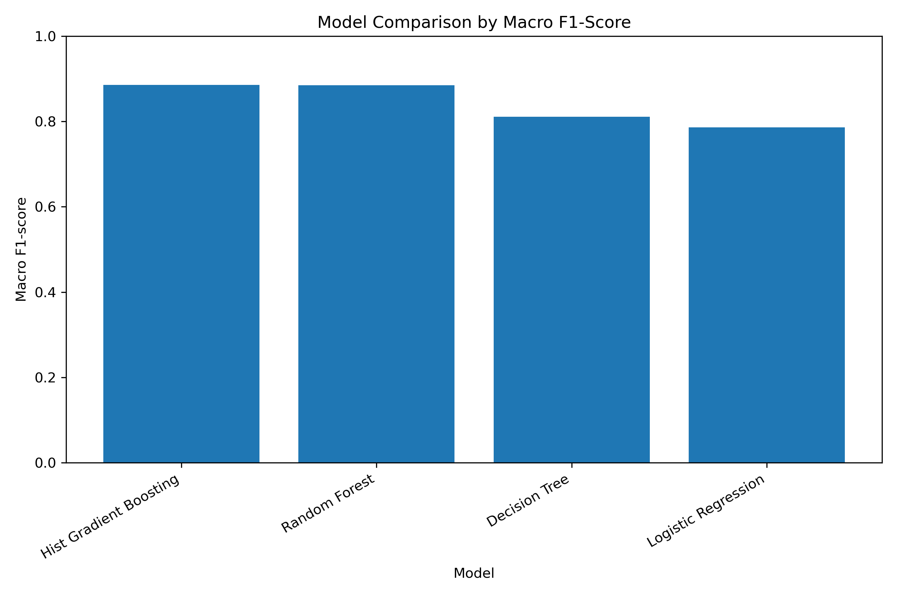
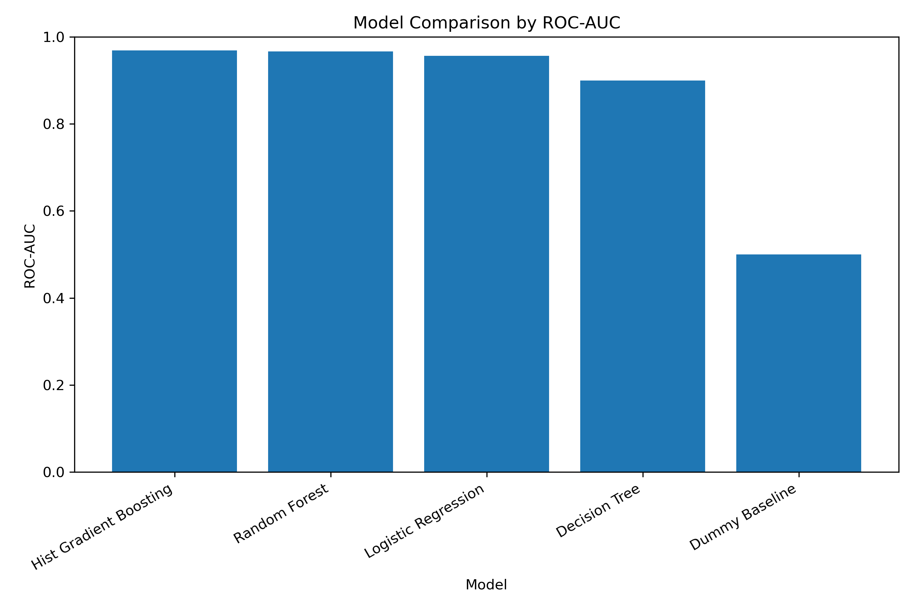
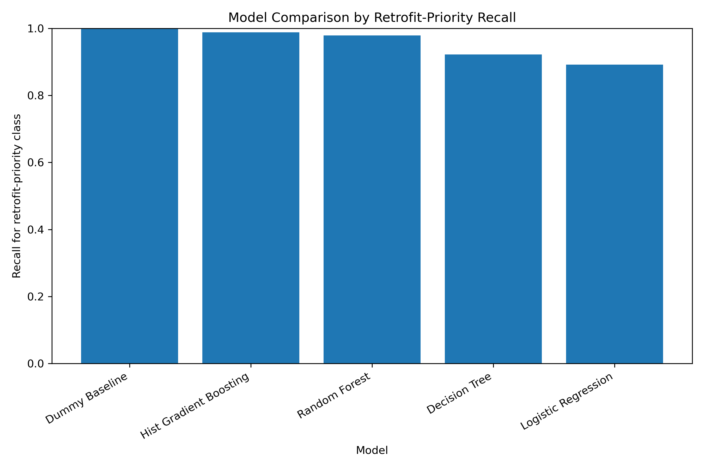
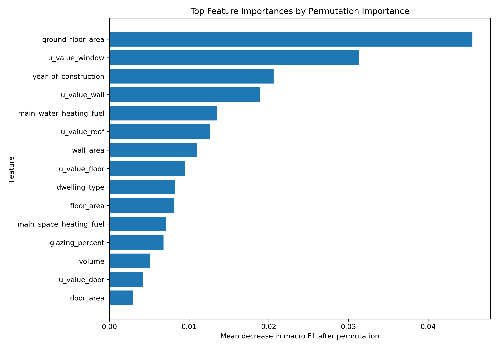

# Explainable Machine Learning for Irish Residential Energy Retrofit Prioritisation Using BER Data

## Project Overview

This project investigates whether Irish Building Energy Rating (BER) data can be used to identify residential dwellings that may require energy retrofit priority.

The project develops a reproducible and explainable machine-learning pipeline that classifies dwellings into:

* **Retrofit priority**
* **Not retrofit priority**

The target is based on BER rating:

* Homes rated **B2 or better** are labelled as **not retrofit priority**.
* Homes rated **worse than B2** are labelled as **retrofit priority**.

This project is framed as a decision-support analysis for residential energy retrofit planning. It is not intended to replace official BER assessment, engineering inspection, or policy decision-making.

---

## Research Question

Can Irish BER data be used to predict residential retrofit priority, and can explainable machine learning identify the main dwelling characteristics associated with poor energy performance?

---

## Motivation

Residential energy efficiency is an important part of Ireland’s sustainability and climate-transition agenda. Many Irish homes differ in construction age, dwelling type, floor area, insulation quality, heating systems, glazing, and energy performance.

Because it is not practical to retrofit all homes immediately, a data-driven approach can help explore which dwelling characteristics are most associated with poor energy performance.

This project uses machine learning to predict retrofit-priority status and explain the main features influencing those predictions.

---

## Dataset

The project uses a cleaned Irish Building Energy Rating dataset.

**Dataset used locally:**

```text
BER (filtered and cleaned 20231005).csv
```

For coding convenience, the file was renamed locally as:

```text
ber_cleaned_20231005.csv
```

The raw dataset is not included in this GitHub repository because of file size and reproducibility practice. To run the project, the dataset must be downloaded separately and placed in:

```text
data/raw/ber_cleaned_20231005.csv
```

The processed modelling dataset is generated automatically by the cleaning pipeline and saved locally to:

```text
data/processed/ber_model_ready.csv
```

Both raw and processed data files are excluded from version control using `.gitignore`.

---

## Target Definition

The binary target variable is:

```text
retrofit_priority
```

The target is created from the `EnergyRating` column.

```text
retrofit_priority = 0
if BER rating is A1, A2, A3, B1, or B2

retrofit_priority = 1
if BER rating is B3, C1, C2, C3, D1, D2, E1, E2, F, or G
```

This means homes worse than BER B2 are treated as retrofit-priority dwellings.

The cleaned modelling dataset contains:

```text
790,389 rows
22 columns
```

Target distribution:

```text
Retrofit priority:     88.84%
Not retrofit priority: 11.16%
```

Because the target is imbalanced, the project evaluates models using balanced accuracy, macro F1-score, ROC-AUC, precision, recall, and confusion matrices rather than accuracy alone.

---

## Project Workflow

```text
Raw BER data
    ↓
Data cleaning and quality checks
    ↓
Target creation
    ↓
Leakage audit and feature selection
    ↓
Exploratory data analysis
    ↓
Preprocessing pipeline
    ↓
Model training and baseline comparison
    ↓
Final model evaluation
    ↓
Explainability analysis
    ↓
Results summary
```

---

## Repository Structure

```text
projects-qudsia-raiyan/
│
├── README.md
├── requirements.txt
├── .gitignore
│
├── data/
│   ├── raw/
│   └── processed/
│
├── docs/
│   └── project_log.md
│
├── models/
│
├── notebooks/
│   └── 01_data_inspection.ipynb
│
├── reports/
│   └── ACM40960_Literature_Review_Raiyan_Qudsia.pdf
│
├── results/
│   ├── figures/
│   └── tables/
│
└── src/
    ├── config.py
    ├── data_cleaning.py
    ├── eda.py
    ├── preprocessing.py
    ├── train_models.py
    ├── evaluate_models.py
    ├── explainability.py
    ├── results_summary.py
    └── run_pipeline.py
```

---

## Tech Stack

* Python
* pandas
* NumPy
* scikit-learn
* matplotlib
* seaborn
* joblib
* Jupyter Notebook
* Git
* GitHub

No cloud tools such as AWS, Airflow, or SageMaker are required for this project. The project is deployed as a reproducible GitHub workflow that can be run locally from source code.

---

## Data Cleaning

The data-cleaning pipeline is implemented in:

```text
src/data_cleaning.py
```

The cleaning stage performs the following steps:

1. Loads selected columns from the raw BER dataset.
2. Renames columns into consistent snake_case format.
3. Converts numerical fields into valid numeric types.
4. Converts placeholder missing values such as blank strings, `NA`, `nan`, `None`, and similar values into proper missing values.
5. Applies data-quality rules for:

   * invalid construction years;
   * invalid U-values;
   * invalid physical area values;
   * invalid glazing percentages;
   * invalid volume values;
   * invalid storey counts.
6. Creates the binary `retrofit_priority` target.
7. Removes target-leakage columns from the modelling dataset.
8. Saves a model-ready dataset locally.
9. Saves audit tables for cleaning, missingness, leakage, and selected-feature rationale.

Important generated audit files:

```text
results/tables/cleaning_summary.csv
results/tables/data_quality_audit.csv
results/tables/leakage_audit.csv
results/tables/selected_features_rationale.csv
results/tables/missingness_after_cleaning.csv
```

---

## Leakage Handling

Because the target is derived from BER rating, care was taken to avoid target leakage.

The following columns were excluded from the modelling features:

| Column                   | Decision           | Reason                                                           |
| ------------------------ | ------------------ | ---------------------------------------------------------------- |
| `EnergyRating`           | Target source only | Used to define `retrofit_priority`, then removed from predictors |
| `BerRating`              | Dropped            | Numerical BER score closely determines the BER band              |
| `CO2Rating`              | Dropped            | BER-related assessment output                                    |
| `TotalCO2Emissions`      | Dropped            | Calculated energy-performance output                             |
| `TotalPrimaryEnergyFact` | Dropped            | Calculated energy-performance output                             |
| `MPCDERValue`            | Dropped            | Derived assessment value                                         |
| `EPCDERValue`            | Dropped            | Derived assessment value                                         |

This prevents the model from learning directly from variables that reveal the BER outcome.

---

## Selected Modelling Features

The model uses physical, dwelling-level, and heating-system variables such as:

* county;
* dwelling type;
* year of construction;
* rating type;
* ground floor area;
* wall, roof, floor, window, and door U-values;
* wall, roof, floor, window, and door areas;
* number of storeys;
* main space-heating fuel;
* main water-heating fuel;
* thermal era;
* glazing percentage;
* volume.

The derived feature `building_age` was not used because it is directly calculated from `year_of_construction`. To avoid redundant predictors and improve interpretability, the project keeps `year_of_construction` only.

---

## Exploratory Data Analysis

The EDA stage is implemented in:

```text
src/eda.py
```

It generates summary tables and figures to understand the dataset before modelling.

Key EDA outputs include:

* BER rating distribution;
* retrofit-priority class distribution;
* county distribution;
* dwelling type distribution;
* heating fuel distribution;
* missingness summary;
* construction year distribution;
* ground floor area distribution;
* priority rate by dwelling type;
* priority rate by heating fuel;
* numerical feature comparisons by target class.

Example figures:

### BER Rating Distribution



### Retrofit Priority Class Distribution



### Top Missingness Rates



### Ground Floor Area by Retrofit-Priority Class



### Year of Construction by Retrofit-Priority Class



---

## Machine-Learning Pipeline

The machine-learning pipeline uses `scikit-learn` tools for reproducible preprocessing and modelling.

Main files:

```text
src/preprocessing.py
src/train_models.py
src/evaluate_models.py
```

The preprocessing pipeline uses:

* `ColumnTransformer`;
* numerical imputation;
* numerical scaling;
* categorical imputation;
* one-hot encoding;
* stratified train-test splitting.

A stratified sample of 100,000 rows is used for modelling. This keeps training computationally efficient while preserving the class distribution.

The train-test split is:

```text
Training rows: 80,000
Test rows:     20,000
```

---

## Models Used

The project compares a dummy baseline with four machine-learning models:

1. Dummy majority-class baseline
2. Logistic Regression
3. Decision Tree
4. Random Forest
5. Hist Gradient Boosting

The dummy baseline is important because the target is imbalanced. Since most dwellings are retrofit priority, a naive model that always predicts the majority class can achieve high accuracy without learning meaningful patterns.

---

## Evaluation Metrics

The project uses:

* accuracy;
* balanced accuracy;
* precision for retrofit-priority class;
* recall for retrofit-priority class;
* F1-score for retrofit-priority class;
* macro F1-score;
* ROC-AUC;
* confusion matrix.

Accuracy alone is not sufficient because the dataset is imbalanced. Macro F1-score, balanced accuracy, and ROC-AUC give a more reliable view of model performance.

---

## Model Results

The best-performing model was:

```text
Hist Gradient Boosting
```

Final best-model performance:

| Metric                      |  Value |
| --------------------------- | -----: |
| Accuracy                    | 0.9586 |
| Balanced accuracy           | 0.8544 |
| Retrofit-priority precision | 0.9657 |
| Retrofit-priority recall    | 0.9885 |
| Retrofit-priority F1-score  | 0.9769 |
| Macro F1-score              | 0.8859 |
| ROC-AUC                     | 0.9688 |

The dummy majority-class baseline achieved:

| Metric            |  Value |
| ----------------- | -----: |
| Accuracy          | 0.8884 |
| Balanced accuracy | 0.5000 |
| Macro F1-score    | 0.4705 |
| ROC-AUC           | 0.5000 |

This shows that the machine-learning models learn meaningful structure beyond simply predicting the majority class.

### Model Comparison by Macro F1-Score



### Model Comparison by ROC-AUC



### Model Comparison by Retrofit-Priority Recall



---

## Explainability Analysis

Explainability is implemented in:

```text
src/explainability.py
```

Permutation importance was used to identify which original dwelling features most influenced model performance.

Top 10 features by permutation importance:

1. `ground_floor_area`
2. `u_value_window`
3. `year_of_construction`
4. `u_value_wall`
5. `main_water_heating_fuel`
6. `u_value_roof`
7. `wall_area`
8. `u_value_floor`
9. `dwelling_type`
10. `floor_area`

These features are physically meaningful because they relate to:

* dwelling size;
* heat loss through windows, walls, roofs, and floors;
* construction age;
* heating and water-heating fuel type;
* building-envelope area;
* dwelling type.

This supports the interpretability of the model because the strongest predictors are consistent with building-energy principles.

### Permutation Importance



---

## Key Interpretation

The results suggest that BER data can be used to classify retrofit-priority dwellings with strong predictive performance.

The best model, Hist Gradient Boosting, achieved high recall for retrofit-priority dwellings. This is important because a retrofit-prioritisation model should identify as many poor-performing dwellings as possible.

The explainability analysis showed that the most influential features are related to building size, thermal transmittance, construction year, heating fuel, dwelling type, and envelope area. These variables are consistent with known building-energy principles.

---

## How to Run the Project

### 1. Clone the repository

```bash
git clone https://github.com/ACM40960/projects-qudsia-raiyan.git
cd projects-qudsia-raiyan
```

### 2. Install requirements

```bash
pip install -r requirements.txt
```

### 3. Add raw dataset

Download the cleaned BER dataset and place it in:

```text
data/raw/ber_cleaned_20231005.csv
```

### 4. Run the full pipeline

```bash
python src/run_pipeline.py
```

This executes:

```text
data cleaning
exploratory data analysis
model training
final model evaluation
explainability analysis
results summary
```

### Optional: Run each stage separately

```bash
python src/data_cleaning.py
python src/eda.py
python src/train_models.py
python src/evaluate_models.py
python src/explainability.py
python src/results_summary.py
```

---

## Main Output Files

### Tables

```text
results/tables/cleaning_summary.csv
results/tables/data_quality_audit.csv
results/tables/leakage_audit.csv
results/tables/selected_features_rationale.csv
results/tables/model_metrics.csv
results/tables/model_metrics_rounded.csv
results/tables/best_model_evaluation_summary.csv
results/tables/best_model_classification_report.csv
results/tables/best_model_confusion_matrix.csv
results/tables/permutation_importance.csv
results/tables/top_features_rounded.csv
results/tables/key_results_summary.txt
```

### Figures

```text
results/figures/ber_rating_distribution.png
results/figures/target_distribution.png
results/figures/model_comparison_macro_f1.png
results/figures/model_comparison_roc_auc.png
results/figures/model_comparison_priority_recall.png
results/figures/permutation_importance_top_features.png
```

---

## Limitations

This project should be interpreted as a data-driven decision-support analysis, not as a replacement for official BER assessment or professional retrofit inspection.

Main limitations:

* The retrofit-priority label is derived from BER rating and is a simplified modelling definition.
* BER data is based on standardised assessment assumptions, not actual household energy consumption.
* The model uses selected dwelling-level variables rather than every available BER field.
* Some BER fields were excluded because of missingness, interpretation difficulty, or leakage risk.
* The model was trained on a stratified sample of 100,000 rows for computational efficiency.
* The analysis identifies statistical associations, not direct causal effects.
* Further validation would be needed before using this type of model in operational retrofit planning.

---

## Future Work

Possible extensions include:

* train selected models on a larger sample or the full dataset;
* compare different retrofit-priority thresholds;
* include more carefully screened BER variables;
* perform county-level or dwelling-type-specific modelling;
* add SHAP explanations for local prediction-level interpretability;
* explore regression models for numerical energy-performance indicators;
* validate results on newer BER records if available.

---

## Authors

* Muhammad Raiyan
* Qudsia Samar Babu Khadar

---

## Module

**ACM 40960: Projects in Mathematical Modelling**
University College Dublin

---

## References

* Sustainable Energy Authority of Ireland. Building Energy Rating information and BER Research Tool.
* Government of Ireland. National Retrofit Plan.
* Mendeley Data. Irish Building Energy Rating Database — Cleaned 05/10/2023.
* Ribeiro, M. T., Singh, S., and Guestrin, C. (2016). “Why Should I Trust You?” Explaining the Predictions of Any Classifier.
* Lundberg, S. M., and Lee, S. I. (2017). A Unified Approach to Interpreting Model Predictions.
